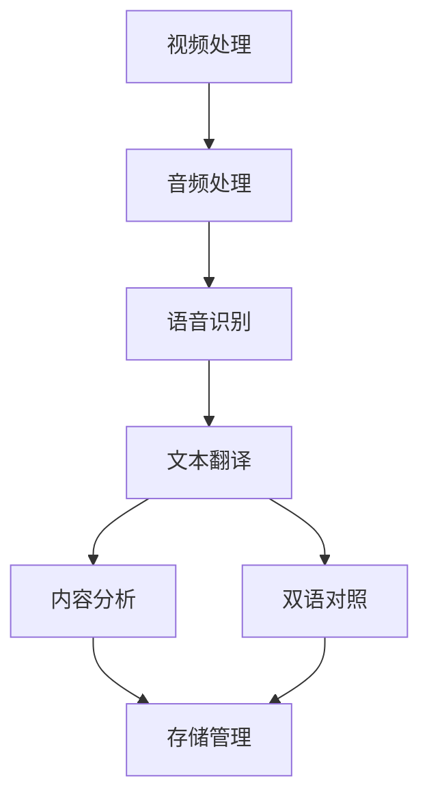

# 基于Langchain的程序架构说明

## 1. 核心组件

### 1.1 处理链 (ProcessingChain)
基于Langchain的顺序处理链，负责协调和管理整个处理流程。

### 1.2 功能组件
- **VideoProcessor**: 视频处理组件
- **TranscriptionProcessor**: 转写处理组件
- **TranslationProcessor**: 翻译处理组件
- **AnalysisProcessor**: 内容分析组件
- **StorageProcessor**: 存储管理组件

## 2. 功能依赖关系



## 3. 处理流程

### 3.1 视频处理流程
- 输入：视频URL
- 处理：下载视频、提取音频
- 输出：音频文件
- 依赖：yt-dlp, ffmpeg
- 错误处理：下载失败重试、格式转换失败处理

### 3.2 音频转写流程
- 输入：音频文件
- 处理：音频分段、语音识别
- 输出：原始文本、时间戳映射
- 依赖：ASR服务
- 错误处理：服务超时重试、分段处理失败恢复

### 3.3 翻译处理流程
- 输入：原始文本
- 处理：文本分段、翻译、格式化
- 输出：译文、双语对照文本
- 依赖：翻译服务
- 错误处理：翻译失败重试、格式化错误处理

### 3.4 内容分析流程
- 输入：译文文本
- 处理：内容总结、主题分类
- 输出：摘要、分类结果
- 依赖：AI分析服务
- 错误处理：服务失败继续执行主流程

### 3.5 存储管理流程
- 输入：处理结果
- 处理：本地存储、云存储上传
- 输出：存储路径、访问URL
- 依赖：OSS服务
- 错误处理：上传失败重试、本地备份

## 4. 数据流转

### 4.1 核心数据结构
```python
{
    "video": {
        "url": str,          # 视频URL
        "id": str,           # 视频ID
        "title": str,        # 视频标题
        "local_path": str    # 本地路径
    },
    "audio": {
        "path": str,         # 音频路径
        "duration": float,   # 时长
        "format": str        # 格式
    },
    "transcript": {
        "segments": List,    # 音频片段
        "text": str,         # 完整文本
        "timestamps": Dict   # 时间戳映射
    },
    "translation": {
        "original": str,     # 原文
        "translated": str,   # 译文
        "bilingual": str     # 双语对照
    },
    "analysis": {
        "summary": str,      # 内容总结
        "category": str,     # 内容分类
        "keywords": List     # 关键词
    },
    "storage": {
        "local_paths": List, # 本地文件路径
        "oss_urls": List     # OSS访问链接
    }
}
```

## 5. 状态管理

### 5.1 处理状态
```
INITIALIZED -> DOWNLOADING -> TRANSCRIBING -> TRANSLATING -> ANALYZING -> STORING -> COMPLETED
      ↓             ↓             ↓              ↓             ↓           ↓          ↓
      └─────────────────────────── FAILED ──────────────────────────────┘           |
                                     ↓                                               |
                                     └────────────── RETRYING ───────────────────────┘
```

### 5.2 错误处理策略
- **致命错误**：直接终止流程
  - 视频下载失败
  - 音频提取失败
  
- **可恢复错误**：自动重试
  - 转写服务超时
  - 翻译服务超时
  - OSS上传失败
  
- **非致命错误**：继续执行
  - 内容分析失败
  - 本地存储失败

## 6. 配置管理

### 6.1 配置层次
```
├── 基础配置（.env）
│   ├── API密钥
│   ├── 服务地址
│   └── 存储配置
│
├── 模型配置（config.py）
│   ├── ASR模型参数
│   ├── 翻译模型参数
│   └── 分析模型参数
│
└── 运行时配置
    ├── 并发限制
    ├── 重试策略
    └── 缓存设置
```

## 7. 外部依赖服务

### 7.1 必需服务
- ASR服务：语音识别
- 翻译服务：文本翻译
- OSS服务：云存储

### 7.2 可选服务
- 内容分析服务：文本分析
- 监控服务：性能监控

## 8. 扩展点

### 8.1 可扩展接口
- 视频源适配器
- 转写服务适配器
- 翻译服务适配器
- 存储服务适配器
- 分析服务适配器

### 8.2 自定义扩展
- 自定义处理链
- 自定义工具集
- 自定义分析规则 