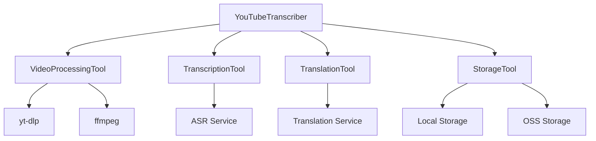

# YouTube视频转录工具 - Langchain版本 V2

## 1. 核心组件

### 1.1 Langchain工具类
- **VideoProcessingTool**
  - 功能：处理YouTube视频，包括下载和音频提取
  - 输入：YouTube视频URL
  - 输出：视频ID、标题和音频路径
  - 主要方法：`_run`、`_arun`（异步暂不支持）

- **TranscriptionTool**
  - 功能：将音频转录为文本
  - 输入：音频文件路径
  - 输出：转写的文本内容
  - 主要方法：`_run`、`_arun`（异步暂不支持）

- **TranslationTool**
  - 功能：将英文文本翻译为中文
  - 输入：要翻译的文本
  - 输出：翻译后的中文文本
  - 主要方法：`_run`、`_arun`（异步暂不支持）

- **StorageTool**
  - 功能：保存文本内容到文件
  - 输入：内容、文件类型、视频ID、视频标题
  - 输出：保存的文件路径
  - 主要方法：`_run`、`_arun`（异步暂不支持）

### 1.2 处理链
- **video_chain**: 视频处理链
- **transcription_chain**: 转写处理链
- **translation_chain**: 翻译处理链
- **processing_chain**: 完整处理链（组合以上三个链）

## 2. 辅助组件

### 2.1 日志系统
- **ServiceFormatter**: 服务日志格式化器
- 日志分类：
  - info_{timestamp}.log: 正常执行日志
  - error_{timestamp}.log: 错误日志
  - debug_{timestamp}.log: 调试日志
  - asr_{timestamp}.log: 语音识别日志
  - translate_{timestamp}.log: 翻译日志

### 2.2 进度跟踪
- **ProcessStep**: 处理步骤定义
- **ProgressTracker**: 进度跟踪器
  - 跟踪处理进度
  - 估算剩余时间
  - 记录步骤耗时

### 2.3 装饰器
- **log_service_call**: 服务调用日志记录
- **retry_on_timeout**: 超时重试处理

## 3. 功能模块

### 3.1 视频处理
- 视频下载（使用yt-dlp）
- 音频提取（使用ffmpeg）
- 格式转换

### 3.2 语音识别
- 音频上传
- ASR服务调用
- 文本提取和格式化

### 3.3 文本翻译
- 文本分段
- 翻译服务调用
- 结果合并

### 3.4 存储管理
- 本地文件存储
- OSS对象存储
- 临时文件清理

### 3.5 内容处理
- 文本格式化
- 内容类型检测
- 内容总结生成

## 4. 配置管理

### 4.1 环境配置
- 目录结构配置
- 模型配置
- OSS配置
- 提示词配置

### 4.2 费用统计
- Token使用统计
- 成本计算
- 费用预警

## 5. 错误处理

### 5.1 异常处理
- 服务调用异常
- 网络超时处理
- 资源清理

### 5.2 重试机制
- API调用重试
- 超时重试
- 错误恢复

## 6. 工具函数

### 6.1 辅助函数
- 视频ID提取
- 时间格式化
- 文本清理
- URL处理

### 6.2 批处理
- URL列表处理
- 批量任务管理

## 7. 命令行接口

### 7.1 参数选项
- --url: 处理单个视频
- --file: 处理视频列表
- --clean: 清理缓存
- --debug: 调试模式

### 7.2 使用示例
```bash
# 处理单个视频
python youtube_transcriber.py --url https://www.youtube.com/watch?v=xxxxx

# 处理多个视频
python youtube_transcriber.py --file video_urls.txt

# 清理缓存
python youtube_transcriber.py --clean

# 调试模式
python youtube_transcriber.py --url https://www.youtube.com/watch?v=xxxxx --debug
``` 

## 8. 功能流程

### 8.1 主要处理流程
1. **初始化阶段**
   - 加载环境变量和配置
   - 初始化日志系统
   - 创建必要的目录结构
   - 初始化Langchain工具和处理链

2. **视频处理阶段** (VideoProcessingTool)
   - 接收YouTube视频URL
   - 使用yt-dlp下载视频
   - 提取音频并转换为WAV格式
   - 返回视频信息和音频路径

3. **音频转写阶段** (TranscriptionTool)
   - 上传音频文件到OSS
   - 调用ASR服务进行语音识别
   - 等待转写任务完成
   - 提取并格式化转写文本

4. **文本翻译阶段** (TranslationTool)
   - 将文本分段处理
   - 调用翻译服务
   - 合并翻译结果
   - 保持时间戳对齐

5. **存储处理阶段** (StorageTool)
   - 保存原始转写文本
   - 保存翻译后的文本
   - 生成双语对照文档
   - 可选：生成内容总结

### 8.2 数据流转
```
[YouTube URL] -> VideoProcessingTool
                 ↓
[Audio File] -> TranscriptionTool
                ↓
[Original Text] -> TranslationTool
                  ↓
[Translated Text] -> StorageTool
                    ↓
[Final Documents]
```

### 8.3 并行处理
1. **批量视频处理**
   - 读取URL列表
   - 顺序处理每个视频
   - 独立的错误处理

2. **文本分段处理**
   - 大文本自动分段
   - 并行翻译处理
   - 结果自动合并

### 8.4 状态管理
1. **进度跟踪**
   - 实时显示当前步骤
   - 预估剩余时间
   - 记录处理耗时

2. **资源管理**
   - 临时文件跟踪
   - 自动清理机制
   - 异常情况处理

### 8.5 错误恢复
1. **断点续传**
   - 记录处理状态
   - 支持任务恢复
   - 避免重复处理

2. **错误重试**
   - API调用重试
   - 网络超时处理
   - 资源释放

### 8.6 输出处理
1. **文件组织**
   - 按视频ID分类
   - 时间戳命名
   - 多种格式支持

2. **内容优化**
   - 格式规范化
   - 双语对照
   - 内容总结

### 8.7 监控反馈
1. **处理监控**
   - 实时日志记录
   - 性能统计
   - 资源使用监控

2. **成本控制**
   - API调用统计
   - 费用预估
   - 超限预警

## 9. 组件示例与最佳实践

### 9.1 工具类使用示例
1. **VideoProcessingTool示例**
```python
# 初始化工具
video_processor = VideoProcessingTool(transcriber=transcriber)

# 处理视频
result = video_processor.run("https://www.youtube.com/watch?v=xxxxx")
print(f"视频ID: {result['video_id']}")
print(f"视频标题: {result['video_title']}")
print(f"音频路径: {result['audio_path']}")
```

2. **TranscriptionTool示例**
```python
# 初始化工具
transcriber_tool = TranscriptionTool(transcriber=transcriber)

# 转写音频
text = transcriber_tool.run("path/to/audio.wav")
print(f"转写结果: {text[:100]}...")
```

3. **TranslationTool示例**
```python
# 初始化工具
translator_tool = TranslationTool(transcriber=transcriber)

# 翻译文本
translated = translator_tool.run("Hello, this is a test.")
print(f"翻译结果: {translated}")
```

4. **StorageTool示例**
```python
# 初始化工具
storage_tool = StorageTool(transcriber=transcriber)

# 保存文件
file_path = storage_tool.run(
    content="测试内容",
    file_type="original",
    video_id="test123",
    video_title="测试视频"
)
print(f"保存路径: {file_path}")
```

### 9.2 组件依赖关系


## 10. 测试规范

### 10.1 单元测试
1. **工具类测试**
```python
def test_video_processing_tool():
    # 初始化测试环境
    transcriber = MockTranscriber()
    tool = VideoProcessingTool(transcriber=transcriber)
    
    # 测试成功场景
    result = tool.run(TEST_VIDEO_URL)
    assert 'video_id' in result
    assert 'video_title' in result
    assert 'audio_path' in result
    
    # 测试失败场景
    with pytest.raises(ValueError):
        tool.run("invalid_url")
```

2. **集成测试**
```python
def test_full_processing_chain():
    chain = processing_chain.run({
        "url": TEST_VIDEO_URL
    })
    assert chain.get("video_id")
    assert chain.get("translated_text")
```

### 10.2 性能测试
1. **基准测试**
   - 视频下载速度
   - 音频转换时间
   - ASR处理时间
   - 翻译响应时间

2. **负载测试**
   - 并发处理能力
   - 内存使用情况
   - CPU使用率
   - 网络带宽使用

## 11. 性能优化

### 11.1 处理优化
1. **并行处理优化**
   - 使用线程池处理并发请求
   - 实现异步处理机制
   - 优化资源分配

2. **缓存优化**
   - 实现本地缓存
   - 使用Redis缓存
   - 优化缓存策略

### 11.2 资源优化
1. **内存优化**
   - 流式处理大文件
   - 及时释放资源
   - 控制内存使用

2. **存储优化**
   - 压缩临时文件
   - 定期清理缓存
   - 优化文件结构

## 12. API接口

### 12.1 REST API
```python
@app.post("/process")
async def process_video(
    url: str,
    options: Optional[Dict] = None
):
    """处理视频的API端点"""
    return {"task_id": "..."}

@app.get("/status/{task_id}")
async def get_status(task_id: str):
    """获取处理状态的API端点"""
    return {"status": "..."}
```

### 12.2 WebSocket API
```python
@app.websocket("/ws/{task_id}")
async def websocket_endpoint(
    websocket: WebSocket,
    task_id: str
):
    """实时进度推送的WebSocket端点"""
    await websocket.accept()
    while True:
        progress = await get_progress(task_id)
        await websocket.send_json(progress)
```

## 13. 配置选项

### 13.1 基础配置
```yaml
# config.yaml
processing:
  video:
    max_duration: 7200  # 最大视频时长（秒）
    formats: ["mp4", "webm"]
  audio:
    format: "wav"
    sample_rate: 16000
    channels: 1

services:
  asr:
    model: "paraformer-v2"
    timeout: 600
  translation:
    model: "qwen-mt-plus"
    batch_size: 500
```

### 13.2 高级配置
```yaml
# advanced_config.yaml
optimization:
  parallel:
    max_workers: 4
    chunk_size: 1000
  cache:
    enabled: true
    ttl: 3600

monitoring:
  metrics:
    enabled: true
    interval: 60
  alerts:
    cost_threshold: 100
    error_threshold: 0.05
``` 