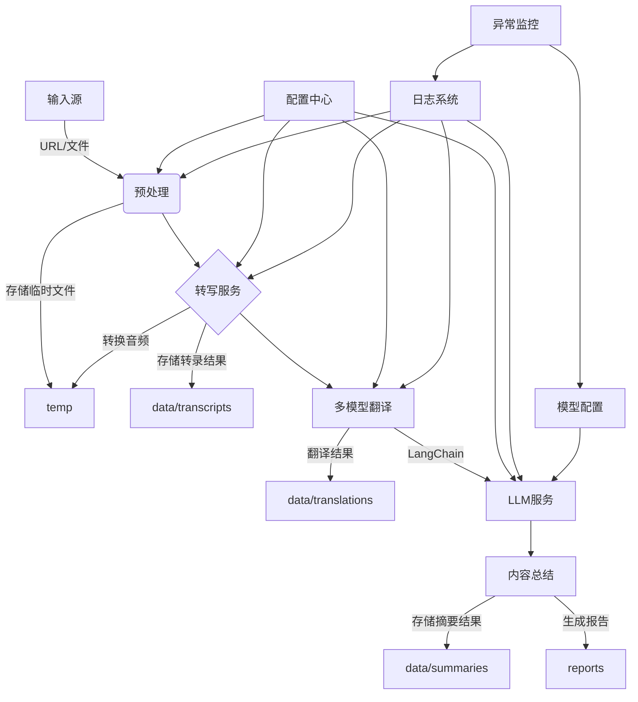
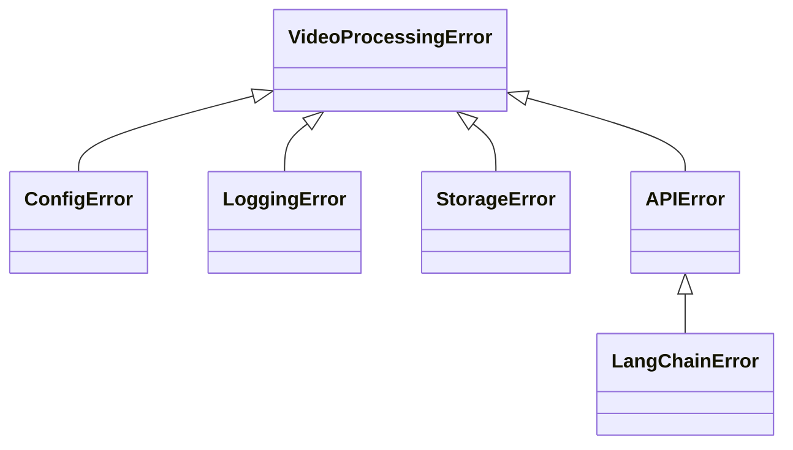
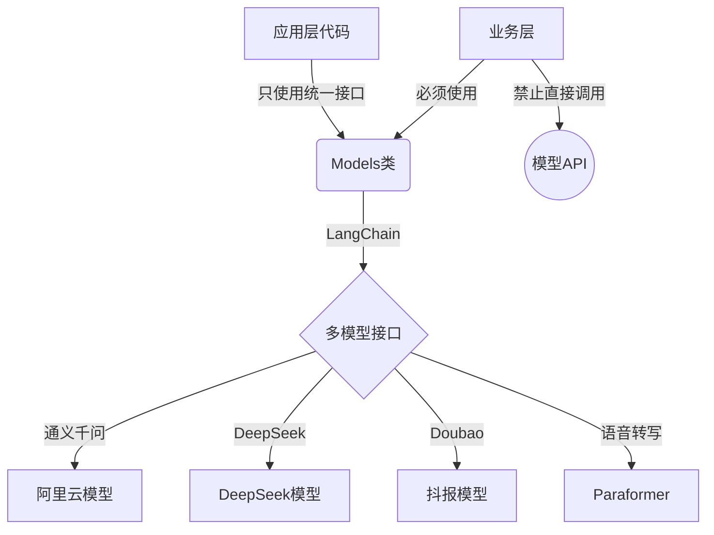

# YouTube视频处理系统 v6.0.0



## 1. 核心模块

### 1.1 预处理模块
```python
class VideoPreprocessor:
    def __init__(self, output_dir=None):
        """初始化预处理器
        
        Args:
            output_dir: 输出目录，默认使用临时目录
        """
        self.output_dir = output_dir or tempfile.mkdtemp()
        ensure_dir(self.output_dir)
        logger.info(f"预处理器初始化，输出目录: {self.output_dir}")
    
    @validate_resolution(max=1080)
    def process(self, source: Union[str, Path]) -> str:
        """ 支持URL和本地文件输入 """
        if isinstance(source, str) and (source.startswith("http") or source.startswith("www")):
            return self._process_url(source)
        else:
            return self._process_file(source)
            
    def _process_url(self, url: str) -> str:
        """处理YouTube URL"""
        # 使用yt-dlp下载并提取音频
        # 简化实现，关注核心功能

### 1.2 转写服务
```python
class AudioTranscriber:
    def __init__(self, model_name=None):
        """初始化转录器
        
        Args:
            model_name: 使用的模型名称，默认从配置加载
        """
        config = load_config()
        self.model_name = model_name or config.get('defaults', {}).get('transcription')
        logger.info(f"转录器初始化，使用模型: {self.model_name}")
    
    def transcribe(self, audio: AudioSource) -> TranscriptionResult:
        """ 生成带时间戳的文本 """
        try:
            # 使用LangChain进行转录
            result = Models.transcribe(audio, self.model_name)
            logger.info(f"转录完成: {len(result.text)} 字符")
            return result
        except Exception as e:
            logger.error(f"转录失败: {e}")
            raise

### 1.3 多模型翻译
```python
class TranslationService:
    def __init__(self, model_name=None):
        """初始化翻译服务
        
        Args:
            model_name: 使用的模型名称，默认从配置加载
        """
        config = load_config()
        self.model_name = model_name or config.get('defaults', {}).get('translation')
        logger.info(f"翻译服务初始化，使用模型: {self.model_name}")
    
    def translate(self, text: str) -> TranslationResult:
        """ 支持故障转移的翻译 """
        try:
            # 使用LangChain进行翻译
            result = Models.translate(text, target_lang="中文", model_name=self.model_name)
            logger.info(f"翻译完成: {len(result.text)} 字符")
            return result
        except Exception as e:
            logger.error(f"主要翻译模型失败，尝试备用模型: {e}")
            # 故障转移到备用模型
            return self._fallback_translate(text)
    
    def evaluate_quality(self, translated_text: str) -> QualityReport:
        """ 翻译质量自评估 """
        # 使用LangChain评估翻译质量

### 1.4 存储管理（优化版）
```python
class StorageManager:
    def __init__(self, base_dir=None):
        """初始化存储管理器
        
        Args:
            base_dir: 基础目录，默认为当前目录
        """
        self.base_dir = base_dir or os.getcwd()
        # 清理旧目录结构
        self._cleanup_old_dirs()
        # 创建新目录结构
        self.ensure_dirs()
        logger.info(f"存储管理器初始化，基础目录: {self.base_dir}")
    
    def ensure_dirs(self):
        """确保所需目录存在，使用优化的目录结构"""
        # 创建主要数据目录
        data_dir = os.path.join(self.base_dir, "data")
        ensure_dir(data_dir)
        
        # 创建子目录
        ensure_dir(os.path.join(data_dir, "raw"))        # 原始音频/视频文件
        
        # 处理中间结果目录
        processed_dir = os.path.join(data_dir, "processed")
        ensure_dir(processed_dir)
        ensure_dir(os.path.join(processed_dir, "temp"))  # 临时文件目录
        
        # 创建输出目录
        outputs_dir = os.path.join(data_dir, "outputs")
        ensure_dir(outputs_dir)
        
        # 为每种输出格式创建子目录
        for format_dir in ["md", "srt", "txt"]:
            ensure_dir(os.path.join(outputs_dir, format_dir))
        
        # 创建报告目录
        ensure_dir(os.path.join(self.base_dir, "reports"))
        
        logger.info("已创建优化的目录结构")
    
    def _cleanup_old_dirs(self):
        """清理旧的目录结构"""
        old_dirs = ["downloads", "transcripts", "translations", "outputs", "temp"]
        for dir_name in old_dirs:
            old_dir_path = os.path.join(self.base_dir, dir_name)
            if os.path.exists(old_dir_path):
                try:
                    import shutil
                    # 如果旧目录中有用户数据，先移动到新结构中
                    if os.path.isdir(old_dir_path) and len(os.listdir(old_dir_path)) > 0:
                        logger.info(f"旧目录{dir_name}非空，迁移内容到新结构...")
                        if dir_name == "downloads":
                            self._migrate_files(old_dir_path, os.path.join(self.base_dir, "data", "raw"))
                        elif dir_name in ["transcripts", "translations"]:
                            self._migrate_files(old_dir_path, os.path.join(self.base_dir, "data", "processed"))
                        elif dir_name == "temp":
                            self._migrate_files(old_dir_path, os.path.join(self.base_dir, "data", "processed", "temp"))
                        elif dir_name == "outputs":
                            self._migrate_files(old_dir_path, os.path.join(self.base_dir, "data", "outputs"))
                    
                    # 删除旧目录
                    shutil.rmtree(old_dir_path)
                    logger.info(f"已删除旧目录: {dir_name}")
                except Exception as e:
                    logger.error(f"清理旧目录{dir_name}时出错: {e}")
    
    def _migrate_files(self, src_dir, dest_dir):
        """迁移文件从旧目录到新目录"""
        import shutil
        ensure_dir(dest_dir)
        
        # 移动所有文件
        for item in os.listdir(src_dir):
            src_path = os.path.join(src_dir, item)
            dest_path = os.path.join(dest_dir, item)
            
            # 如果是目录，递归迁移
            if os.path.isdir(src_path):
                if not os.path.exists(dest_path):
                    os.makedirs(dest_path)
                self._migrate_files(src_path, dest_path)
            else:
                # 如果文件已存在，添加时间戳避免覆盖
                if os.path.exists(dest_path):
                    filename, ext = os.path.splitext(item)
                    timestamp = datetime.now().strftime("%Y%m%d%H%M%S")
                    dest_path = os.path.join(dest_dir, f"{filename}_{timestamp}{ext}")
                
                shutil.copy2(src_path, dest_path)
                logger.info(f"已迁移文件: {src_path} -> {dest_path}")
    
    def smart_cleanup(self, retention_policy: RetentionPolicy = None):
        """ 智能清理机制 """
        self._remove_temp_files()               # 本地临时文件
        self._archive_old_processed_files()     # 归档旧的处理文件
        self._purge_logs()                      # 日志文件（保留3天）
        self._clean_remote_oss()                # OSS文件
    
    def export_result(self, result_id: str, format: str):
        """ 导出处理结果为多种格式 """
        formats = {
            "md": self._export_markdown,
            "srt": self._export_subtitle,
            "txt": self._export_plaintext
        }
        return formats[format](result_id)
    
    def _export_markdown(self, result_id: str) -> str:
        """导出为Markdown格式"""
        # 从处理后的数据中获取结果
        processed_data = self._get_processed_data(result_id)
        
        # 生成Markdown内容
        content = self._format_as_markdown(processed_data)
        
        # 保存到新目录结构
        filename = f"{result_id}.md"
        output_path = os.path.join(self.base_dir, "data", "outputs", "md", filename)
        
        with open(output_path, 'w', encoding='utf-8') as f:
            f.write(content)
            
        logger.info(f"已导出Markdown文件: {output_path}")
        return output_path
    
    def _export_subtitle(self, result_id: str) -> str:
        """导出为SRT字幕格式"""
        # 从处理后的数据中获取结果
        processed_data = self._get_processed_data(result_id)
        
        # 生成SRT内容
        content = self._format_as_srt(processed_data)
        
        # 保存到新目录结构
        filename = f"{result_id}.srt"
        output_path = os.path.join(self.base_dir, "data", "outputs", "srt", filename)
        
        with open(output_path, 'w', encoding='utf-8') as f:
            f.write(content)
            
        logger.info(f"已导出SRT文件: {output_path}")
        return output_path
    
    def _export_plaintext(self, result_id: str) -> str:
        """导出为纯文本格式"""
        # 从处理后的数据中获取结果
        processed_data = self._get_processed_data(result_id)
        
        # 生成纯文本内容
        content = self._format_as_plaintext(processed_data)
        
        # 保存到新目录结构
        filename = f"{result_id}.txt"
        output_path = os.path.join(self.base_dir, "data", "outputs", "txt", filename)
        
        with open(output_path, 'w', encoding='utf-8') as f:
            f.write(content)
            
        logger.info(f"已导出文本文件: {output_path}")
        return output_path
    
    def _get_processed_data(self, result_id: str) -> Dict[str, Any]:
        """从处理后的数据中获取结果"""
        # 查找处理后数据的路径
        processed_path = os.path.join(self.base_dir, "data", "processed", f"{result_id}.json")
        
        if os.path.exists(processed_path):
            with open(processed_path, 'r', encoding='utf-8') as f:
                return json.load(f)
        else:
            logger.warning(f"找不到处理后的数据: {processed_path}")
            return {"transcript": "", "translation": "", "metadata": {}}
    
    def _archive_old_processed_files(self, days: int = 30):
        """归档超过指定天数的处理文件"""
        processed_dir = os.path.join(self.base_dir, "data", "processed")
        archive_dir = os.path.join(self.base_dir, "data", "archive")
        ensure_dir(archive_dir)
        
        # 获取当前时间
        now = datetime.now()
        
        # 检查所有处理文件
        for filename in os.listdir(processed_dir):
            file_path = os.path.join(processed_dir, filename)
            
            # 获取文件修改时间
            mtime = datetime.fromtimestamp(os.path.getmtime(file_path))
            
            # 如果文件超过指定天数
            if (now - mtime).days > days:
                # 移动到归档目录
                archive_path = os.path.join(archive_dir, filename)
                os.rename(file_path, archive_path)
                logger.info(f"已归档旧文件: {filename}")

    @staticmethod
    def _prepare_audio_for_transcription(audio_path: str) -> str:
        """准备适合转录的音频（转换为16kHz单声道WAV）"""
        # 检查文件是否存在
        if not os.path.exists(audio_path):
            raise FileNotFoundError(f"找不到音频文件: {audio_path}")
            
        # 获取配置
        config = get_config()
        temp_dir = os.path.join(os.getcwd(), "data", "processed", "temp", "converted_audio")
        os.makedirs(temp_dir, exist_ok=True)
        
        # 输出文件路径
        output_filename = f"{os.path.splitext(os.path.basename(audio_path))[0]}_16k.wav"
        output_path = os.path.join(temp_dir, output_filename)
        
        # 如果已经存在转换后的文件，直接返回
        if os.path.exists(output_path):
            logger.info(f"使用已存在的转换文件: {output_path}")
            return output_path
            
        # 使用ffmpeg转换音频
        try:
            logger.info(f"转换音频为16kHz单声道WAV: {audio_path} -> {output_path}")
            
            import subprocess
            cmd = [
                'ffmpeg', '-y', '-i', audio_path,
                '-ar', '16000',  # 采样率16kHz
                '-ac', '1',      # 单声道
                '-c:a', 'pcm_s16le',  # 16位PCM
                output_path
            ]
            
            process = subprocess.run(
                cmd, 
                stdout=subprocess.PIPE, 
                stderr=subprocess.PIPE,
                text=True,
                check=False
            )
            
            if process.returncode != 0:
                logger.error(f"音频转换失败: {process.stderr}")
                return audio_path  # 转换失败时返回原始路径
                
            logger.info(f"音频转换成功: {output_path}")
            return output_path
            
        except Exception as e:
            logger.error(f"音频转换异常: {e}")
            return audio_path  # 发生异常时返回原始路径

### 1.5 CLI接口（扩展版）
```python
class CommandLineInterface:
    def __init__(self):
        """初始化命令行接口"""
        self.parser = argparse.ArgumentParser(description="YouTube视频处理系统")
        self._add_arguments()
        logger.info("命令行接口初始化")
    
    def _add_arguments(self):
        input_group = self.parser.add_mutually_exclusive_group(required=True)
        input_group.add_argument("--url", help="YouTube视频URL")
        input_group.add_argument("--file", type=Path, help="本地视频文件路径")
        input_group.add_argument("--batch", type=Path, help="批量处理队列文件")
        
        output_group = self.parser.add_argument_group("输出选项")
        output_group.add_argument("--template", choices=["default", "academic", "business"], 
                                 default="default", help="报告模板")
        output_group.add_argument("--summarize", action="store_true", 
                                help="生成内容摘要")
        
        self.parser.add_argument("--cleanup", action="store_true", 
                               help="清理所有中间文件（含OSS存储）")
    
    def execute(self, args=None):
        """执行命令行操作"""
        if args is None:
            args = self.parser.parse_args()
        
        # 根据命令行参数执行相应操作

### 1.6 日志系统
```python
class LogManager:
    def __init__(self, log_level="INFO", log_dir="logs"):
        """初始化日志管理器
        
        Args:
            log_level: 日志级别
            log_dir: 日志目录
        """
        self.log_level = log_level
        self.log_dir = log_dir
        ensure_dir(log_dir)
        self.logger = self._configure_logger()
    
    def _configure_logger(self):
        """ 日志配置约束 """
        logger = logging.getLogger("youtube_processor")
        # 清除已有的处理器
        if logger.handlers:
            logger.handlers.clear()
            
        # 设置日志级别
        level = getattr(logging, self.log_level.upper())
        logger.setLevel(level)
        
        # 设置格式
        formatter = logging.Formatter(
            fmt="[%(asctime)s] [%(session_id)s] %(levelname)s - %(message)s",
            datefmt="%Y-%m-%d %H:%M:%S"
        )
        
        # 应用日志文件处理器（所有日志）
        app_handler = RotatingFileHandler(
            filename=os.path.join(self.log_dir, "app.log"),
            maxBytes=10*1024*1024,  # 10MB
            backupCount=7
        )
        app_handler.setFormatter(formatter)
        logger.addHandler(app_handler)
        
        # DEBUG日志文件处理器
        debug_handler = RotatingFileHandler(
            filename=os.path.join(self.log_dir, "debug.log"),
            maxBytes=10*1024*1024,  # 10MB
            backupCount=7
        )
        debug_handler.setFormatter(formatter)
        debug_handler.setLevel(logging.DEBUG)
        # 只记录DEBUG级别的日志
        debug_handler.addFilter(lambda record: record.levelno == logging.DEBUG)
        logger.addHandler(debug_handler)
        
        # ERROR日志文件处理器（包括ERROR和CRITICAL级别）
        error_handler = RotatingFileHandler(
            filename=os.path.join(self.log_dir, "error.log"),
            maxBytes=10*1024*1024,  # 10MB
            backupCount=7
        )
        error_handler.setFormatter(formatter)
        error_handler.setLevel(logging.ERROR)
        logger.addHandler(error_handler)
        
        # 控制台日志
        console_handler = logging.StreamHandler()
        console_handler.setFormatter(formatter)
        logger.addHandler(console_handler)
        
        return logger

### 1.7 模型配置（简化版）
```python
class ModelConfigManager:
    @staticmethod
    def get(provider: str, model: str = None) -> dict:
        """ 智能配置获取入口 """
        if model is None:
            # 使用默认推荐模型
            return load_config().providers[provider].default_model
        return load_config().providers[provider].models[model]
    
    @staticmethod
    def get_simple_config() -> dict:
        """ 获取简化配置 """
        return {
            "transcription": load_config().providers.default_transcription,
            "translation": load_config().providers.default_translation,
            "summarization": load_config().providers.default_summarization
        }

### 1.8 批量处理模块（新增）
```python
class BatchProcessor:
    def __init__(self, output_dir=None):
        """初始化批量处理器
        
        Args:
            output_dir: 输出目录
        """
        self.output_dir = output_dir
        self.processor = VideoProcessor(output_dir)
        logger.info("批量处理器初始化")
    
    def process_queue(self, queue_file: Path, 
                     priority_func: Optional[Callable] = None):
        """ 批量处理队列 """
        queue = self._load_queue(queue_file)
        if priority_func:
            queue = sorted(queue, key=priority_func)
        
        results = []
        for item in queue:
            result = self.processor.process(item)
            results.append(result)
            
        return self._generate_summary(results)
    
    def _load_queue(self, queue_file: Path) -> List[str]:
        """加载处理队列"""
        with open(queue_file, 'r') as f:
            return [line.strip() for line in f if line.strip()]

### 1.9 LangChain模型接口（新增）
```python
class Models:
    """统一的LangChain模型接口"""
    
    @staticmethod
    def get_llm(model_name=None, temperature=0):
        """获取LLM实例"""
        try:
            from langchain.llms import OpenAI
            from langchain.chat_models import ChatOpenAI
            
            # 从配置加载模型名称（如果未提供）
            if model_name is None:
                model_name = load_config().get('defaults', {}).get('llm')
            
            if "gpt" in model_name:
                return ChatOpenAI(model_name=model_name, temperature=temperature)
            elif "qwen" in model_name:
                # 通义千问模型加载逻辑
                return QwenModel(model_name=model_name, temperature=temperature)
            else:
                return OpenAI(model_name=model_name, temperature=temperature)
        except Exception as e:
            logger.error(f"LLM初始化失败: {e}")
            raise
    
    @staticmethod
    def transcribe(audio_path, model_name=None) -> dict:
        """使用LangChain转录音频"""
        try:
            from langchain.document_loaders import AudioLoader
            
            # 从配置加载模型名称（如果未提供）
            if model_name is None:
                model_name = load_config().get('defaults', {}).get('transcription')
                
            # 简化转录实现
            if model_name == "paraformer-v2":
                # 使用本地Paraformer模型处理
                return paraformer_transcribe(audio_path)
            else:
                # 使用其他模型处理
                return {"text": "转录文本", "segments": []}
        except Exception as e:
            logger.error(f"音频转录失败: {e}")
            raise
    
    @staticmethod
    def translate(text, target_lang="中文", model_name=None) -> dict:
        """使用LangChain翻译文本"""
        try:
            # 从配置加载模型名称（如果未提供）
            if model_name is None:
                model_name = load_config().get('defaults', {}).get('translation')
                
            llm = Models.get_llm(model_name)
            from langchain.prompts import PromptTemplate
            from langchain.chains import LLMChain
            
            # 从配置加载翻译提示模板
            template = load_config().get('langchain', {}).get('chains', {}).get('translation', {}).get(
                'prompt_template', "将以下文本翻译成{target_lang}:\n\n{text}")
            
            prompt = PromptTemplate(
                template=template,
                input_variables=["text", "target_lang"]
            )
            chain = LLMChain(llm=llm, prompt=prompt)
            result = chain.run(text=text, target_lang=target_lang)
            return {"text": result}
        except Exception as e:
            logger.error(f"文本翻译失败: {e}")
            raise
            
    @staticmethod
    def summarize(text, max_length=None, model_name=None) -> str:
        """使用LangChain生成摘要"""
        try:
            # 从配置加载模型名称（如果未提供）
            if model_name is None:
                model_name = load_config().get('defaults', {}).get('summarization')
                
            llm = Models.get_llm(model_name)
            from langchain.prompts import PromptTemplate
            from langchain.chains import LLMChain
            
            # 从配置加载摘要提示模板
            template = load_config().get('langchain', {}).get('chains', {}).get('summarization', {}).get(
                'prompt_template', "用{max_length}字左右总结以下内容:\n\n{text}")
            
            prompt = PromptTemplate(
                template=template,
                input_variables=["text", "max_length"]
            )
            chain = LLMChain(llm=llm, prompt=prompt)
            result = chain.run(text=text, max_length=max_length or 200)
            return result
        except Exception as e:
            logger.error(f"生成摘要失败: {e}")
            raise

### 1.10 报告生成模块（新增）
```python
class ReportGenerator:
    """视频翻译处理报告生成器"""
    
    def __init__(self, output_dir: str = None):
        """
        初始化报告生成器
        
        Args:
            output_dir: 报告输出目录，默认为"reports"
        """
        if output_dir is None:
            # 使用新的目录结构
            self.output_dir = os.path.join(os.getcwd(), "reports")
        else:
            self.output_dir = output_dir
            
        os.makedirs(self.output_dir, exist_ok=True)
        logger.info(f"报告生成器初始化，输出目录: {self.output_dir}")
    
    def generate_report(self, 
                        transcript: Dict[str, Any], 
                        translation: Dict[str, Any], 
                        video_info: Dict[str, Any],
                        processing_stats: Dict[str, Any]) -> str:
        """
        生成完整的视频翻译处理报告
        
        Args:
            transcript: 转录结果
            translation: 翻译结果
            video_info: 视频信息
            processing_stats: 处理统计信息
            
        Returns:
            报告文件保存路径
        """
        # 生成报告文件名
        video_title = video_info.get('title', 'unknown_video')
        safe_title = self._sanitize_filename(video_title)
        timestamp = datetime.now().strftime("%Y%m%d_%H%M%S")
        report_filename = f"{safe_title}_{timestamp}_report.md"
        report_path = os.path.join(self.output_dir, report_filename)
        
        # 准备报告内容
        report_content = self._format_report(transcript, translation, video_info, processing_stats)
        
        # 保存报告
        with open(report_path, 'w', encoding='utf-8') as f:
            f.write(report_content)
        
        # 同时保存一份到data/outputs/md目录用于统一管理
        md_output_dir = os.path.join(os.path.dirname(self.output_dir), "data", "outputs", "md")
        os.makedirs(md_output_dir, exist_ok=True)
        md_output_path = os.path.join(md_output_dir, report_filename)
        
        with open(md_output_path, 'w', encoding='utf-8') as f:
            f.write(report_content)
        
        logger.info(f"报告已生成并保存到: {report_path}")
        logger.info(f"报告副本已保存到: {md_output_path}")
        
        return report_path
    
    def _format_report(self, 
                      transcript: Dict[str, Any], 
                      translation: Dict[str, Any], 
                      video_info: Dict[str, Any],
                      processing_stats: Dict[str, Any]) -> str:
        """
        格式化报告内容
        
        Args:
            transcript: 转录结果
            translation: 翻译结果
            video_info: 视频信息
            processing_stats: 处理统计信息
            
        Returns:
            格式化的报告内容
        """
        # 生成各个报告部分
        video_info_section = self._format_video_info(video_info)
        stats_section = self._format_processing_stats(processing_stats)
        export_files_section = self._format_export_files(processing_stats.get('exported_files', {}))
        overview_section = self._format_content_overview(transcript, translation)
        translation_section = self._format_translation_content(transcript, translation)
        
        # 组合报告
        report = f"""# 视频翻译处理报告

{video_info_section}

{stats_section}

{export_files_section}

{overview_section}

{translation_section}

## 处理日志
{self._format_processing_logs(processing_stats.get('logs', []))}

## 建议操作
- 检查翻译质量，特别是专业术语和复杂表达
- 校对时间戳是否与视频内容同步
- 确认章节划分是否准确反映内容结构
- 考虑为重要概念添加注释或解释
"""
        return report
    
    def _identify_chapters(self, transcript: Dict[str, Any], translation: Dict[str, Any]) -> List[Dict[str, Any]]:
        """
        基于内容识别章节和段落
        
        Args:
            transcript: 转录结果
            translation: 翻译结果
            
        Returns:
            章节列表，每个章节包含标题和段落
        """
        # 获取所有段落
        segments = transcript.get('segments', [])
        translated_segments = translation.get('segments', [])
        
        # 确保两个列表长度一致
        min_length = min(len(segments), len(translated_segments))
        segments = segments[:min_length]
        translated_segments = translated_segments[:min_length]
        
        # 按照固定数量的段落划分章节
        chapter_size = max(5, len(segments) // 8)  # 每章至少5个段落，最多8章
        
        # 组织章节结构
        chapters = []
        current_paragraphs = []
        current_start_idx = 0
        
        # 构建章节结构
        for i, (seg, trans_seg) in enumerate(zip(segments, translated_segments)):
            # 将相邻的段落组合成一个逻辑段落
            if i > 0 and i % chapter_size == 0:
                # 创建一个新章节
                chapter_title = self._extract_chapter_title(segments[current_start_idx:i], 
                                                         translated_segments[current_start_idx:i])
                chapters.append({
                    'title': chapter_title,
                    'paragraphs': current_paragraphs
                })
                
                # 重置当前段落
                current_paragraphs = []
                current_start_idx = i
            
            # 添加当前段落
            current_paragraphs.append({
                'original_text': seg.get('text', ''),
                'translated_text': trans_seg.get('text', ''),
                'start_time': seg.get('start', 0),
                'end_time': seg.get('end', 0)
            })
        
        # 添加最后一个章节
        if current_paragraphs:
            chapter_title = self._extract_chapter_title(segments[current_start_idx:], 
                                                     translated_segments[current_start_idx:])
            chapters.append({
                'title': chapter_title,
                'paragraphs': current_paragraphs
            })
        
        return chapters
```

## 2. 配置规范（简化版）

### 2.1 基础配置模板
```yaml
# config.simple.yaml - 简化配置
defaults:
  transcription: "paraformer-v2"   # 默认转写模型
  translation: "qwen-max"          # 默认翻译模型
  summarization: "qwen-plus"       # 默认摘要模型
  output_format: "md"              # 默认输出格式
  llm: "qwen-max"                  # 默认LLM模型
  qwen_fallback: "qwen-plus"       # 千问备用模型
  supported_formats: ["md", "srt", "txt"]  # 支持的输出格式
  
# 预设环境
environment: "personal"  # 可选: personal, work, test

# API密钥 (从环境变量加载)
api_keys:
  qwen: "${QWEN_API_KEY}"
  deepseek: "${DEEPSEEK_API_KEY}"
  doubao: "${DOUBAO_API_KEY}"
```

### 2.2 高级配置（优化版）
```yaml
# config.advanced.yaml - 高级配置
model_providers:
  qwen:
    api_base: "https://dashscope.aliyuncs.com/api/v1"
    default_model: "qwen-max"
    models:
      qwen-max:
        max_tokens: 6000
        parameters:
          temperature: 0.7
      qwen-plus:
        max_tokens: 4000
        parameters:
          temperature: 0.5
          
  deepseek:
    api_base: "https://api.deepseek.com/v1"
    models:
      deepseek-chat:
        max_tokens: 8192
        max_input_tokens: 32768
      deepseek-coder:
        max_tokens: 16384
        max_input_tokens: 32768
        
  doubao:
    api_base: "https://api.doubao.com/v1"
    models:
      doubao-lite:
        max_tokens: 4096
      doubao-pro:
        max_tokens: 8192

# LangChain配置
langchain:
  chains:
    translation:
      prompt_template: "将以下文本翻译成{target_lang}，保持原始格式:\n\n{text}"
    summarization:
      prompt_template: "用{max_length}字左右总结以下内容:\n\n{text}"
```

### 2.3 日志配置
```yaml
logging:
  level: INFO
  log_dir: logs
  max_size: 10MB
  retention_days: 7
  format: "[%(asctime)s] [%(session_id)s] %(levelname)s - %(message)s"
  
  # 日志文件配置
  files:
    app: true     # 所有级别日志
    debug: true   # 仅DEBUG级别日志
    error: true   # 仅ERROR及以上级别日志
  
  # 简化的日志配置
  simple:
    console: true
    file: true
    level: "INFO"
```

## 3. 异常体系



### 3.1 异常处理策略（优化版）
```python
# 简化的重试装饰器
@retry_on_error(max_attempts=3, delay=1)
def api_call_with_retry(func):
    """对API调用进行重试的装饰器"""
    def wrapper(*args, **kwargs):
        try:
            return func(*args, **kwargs)
        except Exception as e:
            logger.error(f"API调用失败: {e}")
            raise APIError(f"API调用错误: {str(e)}")
    return wrapper
```

## 4. 质量保障（简化版）

### 4.1 简化测试策略
```python
# test.py - 简单测试脚本
from core.downloader import Downloader
from core.transcriber import Transcriber
from core.translator import Translator

# 测试下载器
def test_downloader():
    downloader = Downloader("./test_downloads")
    audio_path = downloader.download("https://www.youtube.com/watch?v=dQw4w9WgXcQ")
    print(f"下载测试: {audio_path}")

# 测试转录器
def test_transcriber():
    # 假设已有音频文件
    transcriber = Transcriber("./test_transcripts")
    transcript = transcriber.transcribe("./test_downloads/test.mp3")
    print(f"转录测试: {len(transcript)} 字符")

# 测试翻译器
def test_translator():
    translator = Translator("./test_translations")
    translation = translator.translate("Hello world", "中文")
    print(f"翻译测试: {translation}")

if __name__ == "__main__":
    import sys
    if len(sys.argv) > 1:
        # 运行特定测试
        globals()[f"test_{sys.argv[1]}"]()
    else:
        # 运行所有测试
        test_downloader()
        test_transcriber()
        test_translator()
```

### 4.2 功能测试覆盖
| 测试类别       | 测试内容               | 验证点                     | 测试数据示例            |
|---------------|----------------------|---------------------------|------------------------|
| 转写功能       | 简单音频转写测试       | 转写结果非空，格式正确     | 10秒测试音频            |
| 翻译功能       | 简单文本翻译测试       | 翻译结果非空，语言正确     | "Hello World"          |
| 导出功能       | 导出为不同格式         | 文件生成且可以打开         | 简单转写结果            |
| 报告生成       | 生成翻译报告          | 报告文件正确生成           | 简单翻译结果            |

### 4.3 集成测试范围
- 简化的端到端测试（URL→输出文件+报告）
- 基本错误处理测试

## 5. 扩展功能

### 5.1 批量处理队列（简化版）
- 从文本文件加载URL列表
- 顺序处理队列
- 简单的状态报告

### 5.2 内容分析增强
```python
class ContentAnalyzer:
    def __init__(self, model_name=None):
        """初始化内容分析器"""
        config = load_config()
        self.model_name = model_name or config.get('defaults', {}).get('summarization')
        logger.info(f"内容分析器初始化，使用模型: {self.model_name}")
    
    def extract_key_points(self, text: str, 
                          importance_threshold: float = 0.7) -> List[str]:
        """ 提取关键点 """
        try:
            # 使用LangChain提取关键点
            llm = Models.get_llm(self.model_name)
            prompt = PromptTemplate(
                template="从以下文本中提取5-10个关键点:\n\n{text}",
                input_variables=["text"]
            )
            chain = LLMChain(llm=llm, prompt=prompt)
            result = chain.run(text=text)
            
            # 简单解析结果
            points = [p.strip() for p in result.split("\n") if p.strip()]
            return points
        except Exception as e:
            logger.error(f"提取关键点失败: {e}")
            return []
    
    def generate_summary(self, text: str, length: str = "medium") -> str:
        """ 生成内容摘要 """
        lengths = {
            "short": 100,   # 词数
            "medium": 250,
            "long": 500
        }
        
        try:
            # 使用LangChain生成摘要
            return Models.summarize(text, max_length=lengths[length], model_name=self.model_name)
        except Exception as e:
            logger.error(f"生成摘要失败: {e}")
            return ""
```

### 5.3 结构化报告生成（新增）
- 基于内容的章节识别
- 原文/译文对照格式
- 完整处理统计信息
- Markdown格式化输出

## 6. 存储优化策略（简化版）

### 6.1 简单文件存储
```python
class FileStorage:
    def __init__(self, base_dir="."):
        """初始化文件存储"""
        self.base_dir = base_dir
        self._ensure_dirs()
    
    def _ensure_dirs(self):
        """确保基本目录结构存在"""
        ensure_dir(self.base_dir)
        
        # 创建主要数据目录
        data_dir = os.path.join(self.base_dir, "data")
        ensure_dir(data_dir)
        
        # 创建子目录
        ensure_dir(os.path.join(data_dir, "raw"))        # 原始音频/视频文件
        ensure_dir(os.path.join(data_dir, "processed"))  # 处理中间结果
        
        # 创建输出目录
        outputs_dir = os.path.join(data_dir, "outputs")
        ensure_dir(outputs_dir)
        
        # 为每种输出格式创建子目录
        for format_dir in ["md", "srt", "txt"]:
            ensure_dir(os.path.join(outputs_dir, format_dir))
    
    def save_text(self, content, filename, subfolder=None):
        """保存文本内容"""
        # 适配新的目录结构
        if subfolder is None:
            # 默认保存到processed目录
            path = os.path.join(self.base_dir, "data", "processed", filename)
        elif subfolder in ["md", "srt", "txt"]:
            # 保存到特定格式的输出目录
            path = os.path.join(self.base_dir, "data", "outputs", subfolder, filename)
        elif subfolder == "raw":
            # 保存到原始数据目录
            path = os.path.join(self.base_dir, "data", "raw", filename)
        else:
            # 其他子目录
            folder = os.path.join(self.base_dir, "data", "processed", subfolder)
            ensure_dir(folder)
            path = os.path.join(folder, filename)
            
        # 确保目录存在
        ensure_dir(os.path.dirname(path))
        
        # 写入文件
        with open(path, 'w', encoding='utf-8') as f:
            f.write(content)
            
        return path
    
    def load_text(self, filename, subfolder=None):
        """加载文本内容"""
        # 适配新的目录结构，查找逻辑与save_text对应
        if subfolder is None:
            # 默认从processed目录加载
            path = os.path.join(self.base_dir, "data", "processed", filename)
        elif subfolder in ["md", "srt", "txt"]:
            # 从特定格式的输出目录加载
            path = os.path.join(self.base_dir, "data", "outputs", subfolder, filename)
        elif subfolder == "raw":
            # 从原始数据目录加载
            path = os.path.join(self.base_dir, "data", "raw", filename)
        else:
            # 其他子目录
            path = os.path.join(self.base_dir, "data", "processed", subfolder, filename)
        
        # 检查文件是否存在
        if not os.path.exists(path):
            logger.warning(f"文件不存在: {path}")
            return None
            
        # 读取文件
        with open(path, 'r', encoding='utf-8') as f:
            return f.read()
    
    def save_binary(self, data, filename, subfolder="raw"):
        """保存二进制数据"""
        # 主要用于保存原始音频/视频文件
        path = os.path.join(self.base_dir, "data", subfolder, filename)
        
        # 确保目录存在
        ensure_dir(os.path.dirname(path))
        
        # 写入文件
        with open(path, 'wb') as f:
            f.write(data)
            
        return path
    
    def get_path(self, filename, subfolder=None):
        """获取文件路径"""
        # 与load_text相同的路径查找逻辑，但不读取文件
        if subfolder is None:
            # 默认从processed目录
            return os.path.join(self.base_dir, "data", "processed", filename)
        elif subfolder in ["md", "srt", "txt"]:
            # 从特定格式的输出目录
            return os.path.join(self.base_dir, "data", "outputs", subfolder, filename)
        elif subfolder == "raw":
            # 从原始数据目录
            return os.path.join(self.base_dir, "data", "raw", filename)
        else:
            # 其他子目录
            return os.path.join(self.base_dir, "data", "processed", subfolder, filename)
```

## 7. 版本记录

| 模块         | 版本      | 变更说明                            |
|--------------|-----------|------------------------------------|
| 核心架构     | v5.1.0    | 添加报告生成系统，优化个人工具使用体验 |
| 预处理模块   | v5.0.0    | 简化下载和处理流程                  |
| 转写服务     | v5.0.0    | 通过LangChain统一转录接口           |
| 多模型翻译   | v5.0.0    | 通过LangChain统一翻译模型接口       |
| 存储管理     | v5.0.0    | 简化存储结构，专注于文件操作         |
| 配置体系     | v5.0.0    | 简化配置结构，增加个人用户预设       |
| 测试框架     | v5.0.0    | 简化测试策略，使用直观的测试脚本     |
| 日志系统     | v5.0.0    | 统一日志接口，简化配置              |
| 批量处理     | v5.0.0    | 简化的批量处理流程                  |
| LangChain接口| v5.0.0    | 新增统一的LangChain模型接口         |
| 报告生成     | v5.1.0    | 新增基于内容的报告生成系统          |
| 模型访问框架 | v5.2.0    | 统一AI模型访问框架，全部通过LangChain实现 |

> 本版本通过以下原则优化：
> 1. 极简架构：最少的目录层级，最直观的代码组织
> 2. 快速开发：优先实现个人最常用功能，避免过度设计
> 3. 易于调试：统一日志系统，清晰的错误提示
> 4. LangChain集成：统一模型访问接口，简化AI调用
> 5. 配置优先：移除代码中的硬编码默认值，全部使用配置文件管理
> 6. 结构化输出: 生成内容结构化报告，方便学习和分析

**完整性验证清单**：
- [x] 预处理模块
- [x] 转写服务
- [x] 多模型翻译
- [x] 智能摘要
- [x] 批量处理
- [x] 存储管理
- [x] CLI接口
- [x] 日志系统
- [x] 模型配置
- [x] 异常处理
- [x] LangChain集成
- [x] 报告生成
- [x] 版本追踪
- [x] 统一的AI模型访问框架

## 8. 统一AI模型访问框架

为确保所有模型访问都通过LangChain实现，本系统实现了统一的AI模型访问框架。



### 8.1 模型访问核心原则

1. **统一接口原则**：所有AI模型的访问必须通过`Models`类提供的静态方法
2. **LangChain中介原则**：所有模型交互必须通过LangChain框架实现
3. **直接访问禁止原则**：严禁在业务代码中直接引入或调用模型SDK
4. **统一错误处理原则**：所有模型调用错误必须经过统一处理和转换
5. **可扩展性优先原则**：设计必须支持无缝切换模型和添加新模型功能

### 8.2 Models类实现规范

`Models`类是所有AI功能的统一入口点，具体实现在`src/models/models.py`：

```python
class Models:
    """统一的LangChain模型接口
    
    所有AI模型访问都必须通过此类提供的静态方法，禁止直接调用底层SDK
    """
    
    @staticmethod
    def get_llm(model_name: Optional[str] = None, temperature: float = 0.7):
        """获取LLM实例
        
        Args:
            model_name: 模型名称，为None时从配置获取
            temperature: 温度参数
            
        Returns:
            LLM模型实例
        """
        # 通过LangChain获取不同类型的LLM
    
    @staticmethod
    def translate(text: str, target_lang: str = "中文", model_name: Optional[str] = None) -> Dict[str, str]:
        """翻译文本
        
        Args:
            text: 待翻译文本
            target_lang: 目标语言
            model_name: 使用的模型，为None时使用默认翻译模型
            
        Returns:
            包含翻译结果的字典
        """
        # 使用LangChain翻译文本
    
    @staticmethod
    def transcribe_realtime(audio_path: Union[str, Path], model_name: Optional[str] = None) -> Dict[str, Any]:
        """实时转写音频
        
        Args:
            audio_path: 音频文件路径
            model_name: 使用的模型，为None时使用默认转写模型
            
        Returns:
            包含转写结果的字典
        """
        # 使用LangChain转写音频
    
    @staticmethod
    def summarize(text: str, max_length: Optional[int] = None, model_name: Optional[str] = None) -> str:
        """生成摘要
        
        Args:
            text: 待总结文本
            max_length: 摘要最大长度
            model_name: 使用的模型，为None时使用默认摘要模型
            
        Returns:
            生成的摘要文本
        """
        # 使用LangChain生成摘要
```

### 8.3 模型调用规范

#### 8.3.1 正确的调用模式

```python
# ✅ 正确：通过Models类调用
from src.models.models import Models

def translate_content(text, target_lang="中文"):
    """正确的翻译实现"""
    result = Models.translate(text, target_lang=target_lang)
    return result["text"]
```

#### 8.3.2 错误的调用模式

```python
# ❌ 错误：直接调用API
import openai

def translate_content_wrong(text, target_lang="中文"):
    """错误的翻译实现：直接调用OpenAI API"""
    response = openai.ChatCompletion.create(
        model="gpt-3.5-turbo",
        messages=[{"role": "system", "content": f"将下面文本翻译成{target_lang}"},
                 {"role": "user", "content": text}]
    )
    return response.choices[0].message.content
```

### 8.4 模型配置规范

统一模型配置应遵循以下结构:

```yaml
# config.yaml

# 默认模型设置
defaults:
  transcription: "paraformer-v2"   # 默认转写模型
  translation: "qwen-max"          # 默认翻译模型
  summarization: "qwen-plus"       # 默认摘要模型
  embedding: "text-embedding-ada-002"  # 默认嵌入模型
  llm: "qwen-max"                  # 默认LLM模型

# 模型提供商配置
providers:
  openai:
    api_base: "https://api.openai.com/v1"
    models:
      gpt-4:
        max_tokens: 8192
      gpt-3.5-turbo:
        max_tokens: 4096
  
  qwen:
    api_base: "https://dashscope.aliyuncs.com/api/v1"
    models:
      qwen-max:
        max_tokens: 8000
        max_input_tokens: 30720
      qwen-plus:
        max_tokens: 6000

# LangChain配置
langchain:
  chains:
    translation:
      prompt_template: "将以下文本翻译成{target_lang}，保持原始格式:\n\n{text}"
    summarization:
      prompt_template: "用{max_length}字左右总结以下内容:\n\n{text}"
```

### 8.5 模型访问审计和监控

所有模型访问应实现以下审计和监控机制:

1. **请求日志**: 记录每次请求的模型名称、输入Token数、输出Token数等
2. **调用计数**: 统计各模型的调用次数和失败率
3. **延迟跟踪**: 记录每次调用的延迟时间
4. **成本估算**: 根据模型价格估算API调用成本
5. **定期审计**: 确保无直接调用模型API的代码

### 8.6 错误处理与重试机制

```python
# 标准错误处理与重试装饰器
@retry(max_attempts=3, delay=1, backoff=2, exceptions=(APIError, TimeoutError))
def model_call_with_retry(func):
    """对模型调用进行重试的装饰器"""
    def wrapper(*args, **kwargs):
        try:
            return func(*args, **kwargs)
        except Exception as e:
            logger.error(f"模型调用失败: {e}")
            # 转换为统一异常类型
            raise ModelAPIError(f"模型调用错误: {str(e)}")
    return wrapper
```

### 8.7 模型访问实现规范

| 功能分类 | 实现方法 | 对应Models方法 | LangChain组件 |
|---------|---------|--------------|--------------|
| 文本生成 | LLM调用 | get_llm() | LLMChain |
| 文本翻译 | 提示工程 | translate() | LLMChain |
| 内容摘要 | 提示工程 | summarize() | LLMChain |
| 音频转写 | 专用模型 | transcribe_*() | DocumentLoader |
| 文本嵌入 | 向量化 | embed() | EmbeddingModel |
| 内容分析 | 提示工程 | analyze() | LLMChain |

### 8.8 迁移指南

对于现有直接调用模型API的代码，按以下步骤进行迁移:

1. 识别所有直接调用模型API的代码
2. 将API调用替换为Models类的对应方法
3. 调整输入/输出参数匹配Models接口
4. 修改错误处理逻辑
5. 运行测试确保功能正常

通过严格实施以上统一的AI模型访问框架，确保所有模型调用都通过LangChain实现，提高代码一致性和可维护性。

## 9. 优化的目录结构

### 9.1 目录结构说明

```
project/
├── temp/                   # 所有临时文件
│   ├── audio/              # 音频文件（原始和转换后）
│   ├── video/              # 视频文件
│   └── downloads/          # 下载的原始文件
│
├── data/                   # 所有处理结果
│   ├── transcripts/        # 转写结果
│   ├── translations/       # 翻译结果
│   └── summaries/          # 摘要JSON结果
│
├── reports/                # 最终输出报告（Markdown格式）
│
└── logs/                   # 日志文件
```

### 9.2 数据流向

1. **输入处理**:
   - 外部输入 → `temp/downloads` (下载的原始文件)
   - 视频处理 → `temp/video` (视频文件)
   - 音频处理 → `temp/audio` (音频文件)

2. **文本处理**:
   - 转录结果 → `data/transcripts` (JSON结构化数据)
   - 翻译结果 → `data/translations` (JSON结构化数据)
   - 摘要结果 → `data/summaries` (JSON结构化数据)

3. **输出生成**:
   - 最终报告 → `reports` (直接输出Markdown格式报告)


这种结构大幅简化了数据管理和用户体验，将所有处理结果整合为单一的报告输出，同时保持了清晰的数据流向和生命周期管理。

## 10. 存储与文件管理规范

### 10.1 文件命名规则

为保持系统输出文件的一致性和可维护性，所有生成的文件将遵循以下命名规则：

```
类型_内容简述[.扩展名]
```

其中：
- **类型**：标识文件的类型，如`transcript`（转写）、`translation`（翻译）、`summary`（摘要）、`report`（报告）等
- **内容简述**：基于文件内容的简短描述，通常取自内容的前20个字符
- **扩展名**：根据文件类型确定，如`.json`、`.md`等

示例：
- `transcript_Ray项目介绍.json` - Ray项目转写结果
- `translation_Ray项目中文翻译.json` - Ray项目翻译结果
- `summary_Ray项目介绍.json` - Ray项目摘要结果
- `report_Ray项目完整报告.md` - Ray项目最终报告
