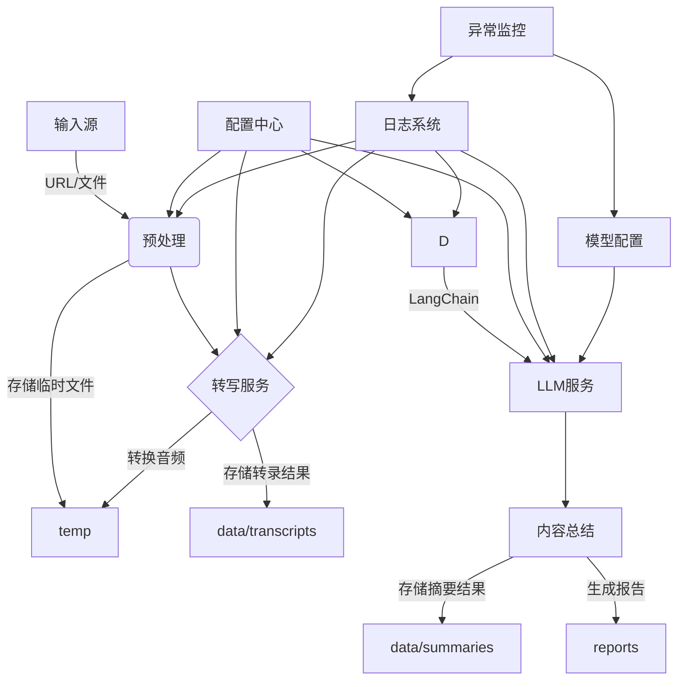
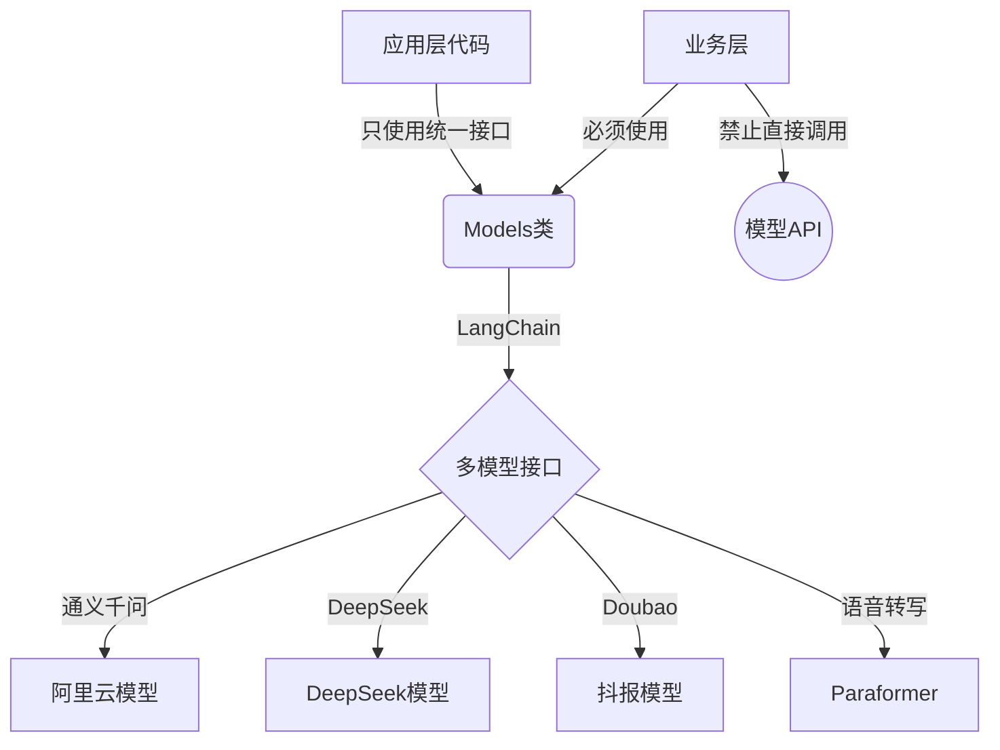

# YouTube视频处理系统 v2.0.0

> **当前系统版本**: v2.0.0 (最后更新：2025-03-10)
> 
> **版本状态**: 稳定版，适用于个人和小型团队使用

## 目录

1. [项目概述](#1-项目概述)
   - [1.1 系统版本与状态](#11-系统版本与状态)
   - [1.2 系统架构图](#12-系统架构图)
   - [1.3 核心功能概述](#13-核心功能概述)
   - [1.4 应用场景](#14-应用场景)

2. [设计原则与理念](#2-设计原则与理念)
   - [2.1 统一AI模型访问框架](#21-统一ai模型访问框架)
   - [2.2 模块化设计](#22-模块化设计)
   - [2.3 错误处理策略](#23-错误处理策略)
   - [2.4 扩展性考虑](#24-扩展性考虑)

3. [系统结构](#3-系统结构)
   - [3.1 目录结构](#31-目录结构)
   - [3.2 数据流向](#32-数据流向)
   - [3.3 存储管理](#33-存储管理)
   - [3.4 文件命名规则](#34-文件命名规则)

4. [核心模块说明](#4-核心模块说明)
   - [4.1 预处理模块](#41-预处理模块)
   - [4.2 转写服务](#42-转写服务)
   - [4.3 多模型翻译](#43-多模型翻译)
   - [4.4 内容分析](#44-内容分析)
   - [4.5 报告生成](#45-报告生成)

5. [配置体系](#5-配置体系)
   - [5.1 基础配置](#51-基础配置)
   - [5.2 高级配置](#52-高级配置)
   - [5.3 日志配置](#53-日志配置)

6. [模型集成](#6-模型集成)
   - [6.1 模型接口规范](#61-模型接口规范)
   - [6.2 模型调用示例](#62-模型调用示例)
   - [6.3 模型配置指南](#63-模型配置指南)

7. [功能扩展与优化](#7-功能扩展与优化)
   - [7.1 批量处理](#71-批量处理)
   - [7.2 报告模板](#72-报告模板)
   - [7.3 性能优化](#73-性能优化)
   - [7.4 时间追踪系统](#74-时间追踪系统)

8. [版本管理](#8-版本管理)
   - [8.1 当前版本说明](#81-当前版本说明)
   - [8.2 版本更新记录](#82-版本更新记录)
   - [8.3 路线图](#83-路线图)

---

## 1. 项目概述

### 1.1 系统版本与状态

**当前系统版本**: v2.0.0 (最后更新：2025-03-10)

**版本状态**: 稳定版，适用于个人和小型团队使用

### 1.2 系统架构图



### 1.3 核心功能概述

本系统提供以下核心功能：

- YouTube视频下载与预处理
- 音频提取与OSS云转写
- 多模型文本翻译与并行处理
- 内容分析与摘要生成
- 结构化报告生成
- 批量视频处理
- 精确时间追踪与性能分析

#### 1.3.1 系统流程概述

1. **视频获取**：下载YouTube视频或使用本地视频文件
2. **音频提取**：从视频中提取音频流
3. **音频转写**：使用阿里云OSS和通义千问的paraformer模型进行音频转写
4. **文本翻译**：使用LangChain访问通义千问API翻译文本
5. **内容分析**：生成内容摘要和关键点提取
6. **报告生成**：基于模板生成包含视频信息、原文、译文和摘要的综合报告

### 1.4 应用场景

- 个人学习：快速获取外语视频内容
- 研究分析：处理研讨会、讲座等学术内容
- 会议记录：将视频会议转化为文字记录
- 内容创作：辅助国外内容本地化

## 2. 设计原则与理念

### 2.1 统一AI模型访问框架

系统实现了统一的AI模型访问框架，所有模型访问都通过LangChain实现，遵循以下原则：

- **统一接口原则**：所有AI模型的访问必须通过`Models`类提供的静态方法
- **LangChain中介原则**：所有模型交互必须通过LangChain框架实现
- **直接访问禁止原则**：严禁在业务代码中直接引入或调用模型SDK
- **统一错误处理原则**：所有模型调用错误必须经过统一处理和转换
- **可扩展性优先原则**：设计必须支持无缝切换模型和添加新模型功能



### 2.2 模块化设计

系统采用高度模块化设计，确保各组件之间松耦合，易于维护和扩展：

- 预处理模块负责视频获取与转换
- 转写服务处理音频文件转文本
- 翻译服务支持多模型故障转移
- 存储管理统一文件操作
- 报告生成模块整合处理结果

### 2.3 错误处理策略

系统实现了统一的错误处理机制：

- 业务异常与技术异常分离
- 多层级日志系统记录详细错误信息
- 关键操作支持自动重试
- 提供故障转移机制保证服务可用性

```python
# 标准错误处理与重试装饰器
@retry(max_attempts=3, delay=1, backoff=2, exceptions=(APIError, TimeoutError))
def model_call_with_retry(func):
    """对模型调用进行重试的装饰器"""
    def wrapper(*args, **kwargs):
        try:
            return func(*args, **kwargs)
        except Exception as e:
            logger.error(f"模型调用失败: {e}")
            # 转换为统一异常类型
            raise ModelAPIError(f"模型调用错误: {str(e)}")
    return wrapper
```

### 2.4 扩展性考虑

系统设计考虑未来扩展：

- 支持多种AI模型无缝切换
- 配置系统支持不同场景自定义
- 插件化架构便于添加新功能
- 数据接口标准化便于与其他系统集成

## 3. 系统结构

### 3.1 目录结构

系统采用清晰的目录结构，便于管理和维护：

```
project/
├── src/                    # 源代码目录
│   ├── models/             # 模型相关代码
│   ├── preprocessing/      # 预处理模块
│   ├── reports/            # 报告生成模块
│   ├── utils/              # 工具类和辅助函数
│   ├── config/             # 配置管理
│   └── storage/            # 存储管理模块
│
├── temp/                   # 所有临时文件统一存放在这里
│   ├── audio/              # 提取的音频文件
│   ├── converted_audio/    # 所有转换后的音频文件
│   ├── video/              # 处理过的视频文件
│   └── downloads/          # 下载的原始文件
│
├── data/                   # 处理结果数据
│   ├── transcripts/        # 转写结果 (.json)
│   ├── translations/       # 翻译结果 (.json)
│   ├── summaries/          # 摘要结果 (.json)
│   └── processed/          # 其他处理中间结果（非临时性质）
│
├── reports/                # 最终输出报告（Markdown格式）
│
├── logs/                   # 日志文件
│
└── config.yaml             # 配置文件
```

### 3.2 数据流向

系统数据处理流程清晰：

1. **输入处理**:
   - 外部URL/文件 → `VideoPreprocessor.process()`
   - 下载的原始内容 → `temp/downloads/[文件名]`
   - 处理的视频文件 → `temp/video/[视频文件名].mp4`
   - 提取的音频 → `temp/audio/[音频文件名].mp3`
   - 优化音频 → `temp/converted_audio/[音频文件名]_16k.wav`

2. **转写处理**:
   - 优化音频 → 使用`Models.transcribe_file()`处理
   - 转录结果 → 保存到`data/transcripts/transcript_[作者]_[时间戳].json`

3. **翻译处理**:
   - 转录文本 → 使用`Models.translate()`处理
   - 翻译结果 → 保存到`data/translations/translation_[作者]_[时间戳].json`

4. **内容分析**:
   - 翻译文本 → 使用`Models.summarize()`生成摘要
   - 摘要结果 → 保存到`data/summaries/summary_[作者]_[时间戳].json`

5. **报告生成**:
   - 所有处理结果 → 通过`ReportGenerator`整合
   - 最终报告 → 保存到`reports/report_[作者]_[时间戳].md`

### 3.3 存储管理

存储管理策略确保文件有效组织：

1. **`temp/`目录**: 
   - 用于存放所有临时性质的文件
   - 系统可以定期自动清理此目录下较旧的文件
   - 不应包含任何需要长期保存的重要数据

2. **`data/`目录**: 
   - 用于存放有价值的处理结果
   - 子目录结构保持清晰，便于查找和管理
   - 可以按需导出或备份这些数据

3. **`reports/`目录**: 
   - 存放最终生成的报告文件，是系统的主要输出
   - 报告文件自包含，能够独立提供完整的内容分析

### 3.4 文件命名规则

为保持系统输出文件的一致性和可维护性，所有生成的文件遵循以下命名规则：

```
类型_作者_时间戳.扩展名
```

其中：
- **类型**：标识文件的类型，如`transcript`（转写）、`translation`（翻译）、`summary`（摘要）、`report`（报告）等
- **作者**：内容创作者或频道名称，如"Anyscale"
- **时间戳**：文件创建时间，格式为"YYYYMMDD_HHMMSS"
- **扩展名**：根据文件类型确定，如`.json`、`.md`等

示例：
- `transcript_Anyscale_20250309_085543.json` - 转录结果
- `translation_Anyscale_20250309_085615.json` - 翻译结果
- `summary_Anyscale_20250309_085624.json` - 摘要结果
- `report_Anyscale_20250309_085624.md` - 最终报告

## 4. 核心模块说明

### 4.1 预处理模块

预处理模块负责视频下载和转换：

```python
class VideoPreprocessor:
    def __init__(self, output_dir=None):
        """初始化预处理器"""
        self.output_dir = output_dir or tempfile.mkdtemp()
        ensure_dir(self.output_dir)
        logger.info(f"预处理器初始化，输出目录: {self.output_dir}")
    
    @validate_resolution(max=1080)
    def process(self, source: Union[str, Path]) -> str:
        """支持URL和本地文件输入"""
        if isinstance(source, str) and (source.startswith("http") or source.startswith("www")):
            return self._process_url(source)
        else:
            return self._process_file(source)
```

该模块主要功能包括：
- 处理YouTube URL和本地文件
- 下载视频内容并提取音频
- 支持分辨率控制避免资源浪费
- 存储处理的临时文件到指定目录

### 4.2 转写服务

转写服务负责音频转文本：

```python
class AudioTranscriber:
    def __init__(self, model_name: Optional[str] = None, output_dir: Optional[str] = None):
        """
        初始化转写器
        
        Args:
            model_name: 转写模型名称，默认从配置获取
            output_dir: 输出目录，默认从配置获取
        """
        config = get_config()
        self.config = config
        
        # 转写模型
        self.model_name = model_name or config.get('defaults', {}).get('transcription')
        
        # 输出目录
        if output_dir is None:
            output_dir = config.get('storage', {}).get('transcripts_dir', './transcripts')
        
        self.output_dir = ensure_dir(output_dir)
        
        logger.info(f"转写器初始化，使用模型: {self.model_name}, 输出目录: {self.output_dir}")
    
    def transcribe(self, audio_path, save_result=True):
        """
        转录音频文件
        
        参数:
            audio_path: 音频文件路径
            save_result: 是否保存结果到文件
            
        返回:
            TranscriptionResult对象
        """
        if not os.path.exists(audio_path):
            raise FileNotFoundError(f"音频文件不存在: {audio_path}")
        
        # 检查音频时长（仅用于日志记录）
        audio_duration = get_audio_duration(audio_path)
        logger.info(f"音频时长: {audio_duration} 秒")
        
        # 使用统一的OSS文件转录API
        logger.info(f"使用文件转录API，模型：{self.model_name}")
        
        try:
            # 调用Models.transcribe_file方法
            result_dict = Models.transcribe_file(audio_path_str, model_name=self.model_name)
            
            # 解析结果
            result = self._parse_transcription_result(result_dict)
            
            # 保存结果到文件
            if save_result:
                self._save_transcription_result(audio_path, result)
            
            return result
        except Exception as e:
            logger.error(f"转录失败: {e}")
            raise
```

关键特性：
- 统一的OSS文件转录实现，简化代码复杂度
- 支持多种转写模型选择
- 提供时间戳信息便于对照视频
- 集成音频优化前处理，提高转写精度
- 自动保存转写结果和元数据

### 4.3 多模型翻译

翻译服务支持多种模型和并行处理：

```python
class TranslationService:
    def __init__(self, model_name=None, default_target_lang="中文"):
        """
        初始化翻译服务
        
        Args:
            model_name: 翻译模型名称，默认从配置获取
            default_target_lang: 默认目标语言
        """
        config = get_config()
        self.config = config
        
        # 加载翻译模型
        self.model_name = model_name or config.get('defaults', {}).get('translation', 'qwen-max')
        logger.info(f"初始化翻译服务，使用模型: {self.model_name}")
        
        # 默认目标语言
        self.default_target_lang = default_target_lang
        
        # 并行翻译配置
        parallel_config = config.get('translation', {}).get('parallel', {})
        self.parallel_enabled = parallel_config.get('enabled', True)        # 是否启用并行翻译
        self.parallel_min_video_length = parallel_config.get('min_video_length', 3600)  # 启用并行翻译的最小视频长度（秒）
        self.parallel_max_workers = parallel_config.get('max_workers', 16)  # 最大并行工作线程数
        self.parallel_batch_size = parallel_config.get('batch_size', 20)    # 每批处理的段落数量
        self.parallel_progress_report = parallel_config.get('progress_report', True)  # 是否报告翻译进度
    
    def translate(self, text: str, target_lang: str = "中文") -> TranslationResult:
        """
        翻译文本
        
        Args:
            text: 待翻译文本
            target_lang: 目标语言
            
        Returns:
            翻译结果
        """
        # 记录开始翻译
        logger.info(f"开始翻译文本 ({len(text)} 字符) 到 {target_lang}")
        
        # 如果文本为空，直接返回空结果
        if not text or text.strip() == "":
            logger.warning("翻译文本为空")
            return TranslationResult(
                text="",
                target_lang=target_lang,
                source_text=text
            )
        
        try:
            # 使用模型进行翻译
            result = self._translate_with_model(text, target_lang)
            return result
        except Exception as e:
            logger.error(f"翻译失败: {e}")
            # 尝试故障转移到备用模型
            return self._fallback_translate(text, target_lang)
            
    def translate_segments(self, segments: List[Dict[str, Any]], 
                          target_lang: str = "中文", 
                          video_duration: Optional[float] = None) -> List[Dict[str, Any]]:
        """
        翻译带有时间戳的段落列表
        
        Args:
            segments: 带时间戳的片段列表
            target_lang: 目标语言
            video_duration: 视频时长（秒），用于决定是否使用并行翻译
        
        Returns:
            翻译后的段落列表
        """
        # 判断是否启用并行翻译
        use_parallel = (self.parallel_enabled and 
                       video_duration and 
                       video_duration >= self.parallel_min_video_length)
                       
        if use_parallel:
            return self._parallel_translate_segments(segments, target_lang)
        else:
            return self._sequential_translate_segments(segments, target_lang)
```

关键特性：
- 支持多种翻译模型选择，采用统一调用接口
- 长视频智能并行处理，大幅提高翻译效率
- 实时进度报告，提供翻译完成预估时间
- 自动语言检测，避免重复翻译
- 故障转移机制，确保翻译任务可靠完成
- 内置段落优化器，提高翻译质量

### 4.4 内容分析

内容分析模块提供智能摘要与关键点提取：

```python
class ContentAnalyzer:
    def __init__(self, model_name=None):
        """初始化内容分析器"""
        config = load_config()
        self.model_name = model_name or config.get('defaults', {}).get('summarization')
        logger.info(f"内容分析器初始化，使用模型: {self.model_name}")
     
    def extract_key_points(self, text: str, importance_threshold: float = 0.7) -> List[str]:
        """提取关键点"""
        try:
            # 使用LangChain提取关键点
            llm = Models.get_llm(self.model_name)
            prompt = PromptTemplate(
                template="从以下文本中提取5-10个关键点:\n\n{text}",
                input_variables=["text"]
            )
            chain = LLMChain(llm=llm, prompt=prompt)
            result = chain.run(text=text)
            
            # 简单解析结果
            points = [p.strip() for p in result.split("\n") if p.strip()]
            return points
        except Exception as e:
            logger.error(f"提取关键点失败: {e}")
            return []
     
    def generate_summary(self, text: str, length: str = "medium") -> str:
        """生成内容摘要"""
        lengths = {
            "short": 100,   # 词数
            "medium": 250,
            "long": 500
        }
        
        try:
            # 使用LangChain生成摘要
            return Models.summarize(text, max_length=lengths[length], model_name=self.model_name)
        except Exception as e:
            logger.error(f"生成摘要失败: {e}")
            return ""
```

核心功能：
- 文本摘要生成
- 关键点提取
- 可调节摘要长度
- 基于重要性阈值过滤内容

### 4.5 报告生成

报告生成模块整合所有处理结果：

```python
class ReportGenerator:
    def __init__(self, output_dir: str = None):
        """初始化报告生成器"""
        if output_dir is None:
            self.output_dir = os.path.join(os.getcwd(), "reports")
        else:
            self.output_dir = output_dir
            
        os.makedirs(self.output_dir, exist_ok=True)
        logger.info(f"报告生成器初始化，输出目录: {self.output_dir}")
    
    def generate_report(self, 
                        transcript: Dict[str, Any], 
                        translation: Dict[str, Any], 
                        video_info: Dict[str, Any],
                        processing_stats: Dict[str, Any]) -> str:
        """生成完整的视频翻译处理报告"""
        # 生成报告文件名
        video_title = video_info.get('title', 'unknown_video')
        safe_title = self._sanitize_filename(video_title)
        timestamp = datetime.now().strftime("%Y%m%d_%H%M%S")
        report_filename = f"{safe_title}_{timestamp}_report.md"
        report_path = os.path.join(self.output_dir, report_filename)
        
        # 准备报告内容
        report_content = self._format_report(transcript, translation, video_info, processing_stats)
        
        # 保存报告
        with open(report_path, 'w', encoding='utf-8') as f:
            f.write(report_content)
        
        logger.info(f"报告已生成并保存到: {report_path}")
        
        return report_path
```

主要特性：
- 自动生成结构化报告
- 基于内容识别章节和段落
- 支持多种报告模板
- 包含视频元数据和处理统计
- 整合原文与翻译内容对照

## 5. 配置体系

### 5.1 基础配置

系统提供简化的基础配置模板：

```yaml
# config.simple.yaml - 简化配置
defaults:
  transcription: "paraformer-v2"   # 默认转写模型
  translation: "qwen-max"          # 默认翻译模型
  summarization: "qwen-plus"       # 默认摘要模型
  output_format: "md"              # 默认输出格式
  llm: "qwen-max"                  # 默认LLM模型
  qwen_fallback: "qwen-plus"       # 千问备用模型
  supported_formats: ["md", "srt", "txt"]  # 支持的输出格式
  
# 预设环境
environment: "personal"  # 可选: personal, work, test

# API密钥 (从环境变量加载)
api_keys:
  qwen: "${QWEN_API_KEY}"
  deepseek: "${DEEPSEEK_API_KEY}"
  doubao: "${DOUBAO_API_KEY}"
```

主要配置项：
- 默认模型选择
- 环境类型设置
- 安全的API密钥管理
- 输出格式配置

### 5.2 高级配置

高级配置提供更细粒度控制：

```yaml
# config.advanced.yaml - 高级配置
model_providers:
  qwen:
    api_base: "https://dashscope.aliyuncs.com/api/v1"
    default_model: "qwen-max"
    models:
      qwen-max:
        max_tokens: 6000
        parameters:
          temperature: 0.7
      qwen-plus:
        max_tokens: 4000
        parameters:
          temperature: 0.5
          
  deepseek:
    api_base: "https://api.deepseek.com/v1"
    models:
      deepseek-chat:
        max_tokens: 8192
        max_input_tokens: 32768
      deepseek-coder:
        max_tokens: 16384
        max_input_tokens: 32768
        
  doubao:
    api_base: "https://api.doubao.com/v1"
    models:
      doubao-lite:
        max_tokens: 4096
      doubao-pro:
        max_tokens: 8192

# LangChain配置
langchain:
  chains:
    translation:
      prompt_template: "将以下文本翻译成{target_lang}，保持原始格式:\n\n{text}"
    summarization:
      prompt_template: "用{max_length}字左右总结以下内容:\n\n{text}"
```

高级配置内容：
- 模型提供商详细设置
- 每个模型的参数配置
- LangChain链配置
- 自定义提示模板

### 5.3 日志配置

系统实现了多级日志配置：

```python
class LogManager:
    def __init__(self, log_level="INFO", log_dir="logs"):
        """初始化日志管理器"""
        self.log_level = log_level
        self.log_dir = log_dir
        ensure_dir(log_dir)
        self.logger = self._configure_logger()
    
    def _configure_logger(self):
        """日志配置约束"""
        logger = logging.getLogger("youtube_processor")
        # 清除已有的处理器
        if logger.handlers:
            logger.handlers.clear()
            
        # 设置日志级别
        level = getattr(logging, self.log_level.upper())
        logger.setLevel(level)
        
        # 设置格式
        formatter = logging.Formatter(
            fmt="[%(asctime)s] [%(session_id)s] %(levelname)s - %(message)s",
            datefmt="%Y-%m-%d %H:%M:%S"
        )
        
        # 应用日志文件处理器（所有日志）
        app_handler = RotatingFileHandler(
            filename=os.path.join(self.log_dir, "app.log"),
            maxBytes=10*1024*1024,  # 10MB
            backupCount=7
        )
        app_handler.setFormatter(formatter)
        logger.addHandler(app_handler)
        
        # 添加其他级别处理器...
```

日志系统特点：
- 分级日志（INFO、DEBUG、ERROR）
- 日志文件自动轮转
- 会话跟踪支持
- 格式化输出便于分析

## 6. 模型集成

### 6.1 模型接口规范

所有模型访问都通过统一接口实现：

```python
class Models:
    """统一的LangChain模型接口"""
    
    @staticmethod
    def get_llm(model_name=None, temperature=0):
        """获取LLM实例"""
        try:
            from langchain.llms import OpenAI
            from langchain.chat_models import ChatOpenAI
            
            # 从配置加载模型名称（如果未提供）
            if model_name is None:
                model_name = load_config().get('defaults', {}).get('llm')
            
            if "gpt" in model_name:
                return ChatOpenAI(model_name=model_name, temperature=temperature)
            elif "qwen" in model_name:
                # 通义千问模型加载逻辑
                return QwenModel(model_name=model_name, temperature=temperature)
            else:
                return OpenAI(model_name=model_name, temperature=temperature)
        except Exception as e:
            logger.error(f"LLM初始化失败: {e}")
            raise
```

接口规范特点：
- 统一的模型访问入口
- 自动从配置加载默认模型
- 根据模型名称智能选择适配器
- 统一的错误处理

### 6.2 模型调用示例

以下是正确的模型调用范例：

```python
# ✅ 正确：通过Models类调用
from src.models.models import Models

def translate_content(text, target_lang="中文"):
    """正确的翻译实现"""
    result = Models.translate(text, target_lang=target_lang)
    return result["text"]
```

错误的调用方式（禁止使用）：

```python
# ❌ 错误：直接调用API
import openai

def translate_content_wrong(text, target_lang="中文"):
    """错误的翻译实现：直接调用OpenAI API"""
    response = openai.ChatCompletion.create(
        model="gpt-3.5-turbo",
        messages=[{"role": "system", "content": f"将下面文本翻译成{target_lang}"},
                 {"role": "user", "content": text}]
    )
    return response.choices[0].message.content
```

### 6.3 模型配置指南

模型配置应遵循以下结构：

```yaml
# 默认模型设置
defaults:
  transcription: "paraformer-v2"   # 默认转写模型
  translation: "qwen-max"          # 默认翻译模型
  summarization: "qwen-plus"       # 默认摘要模型
  embedding: "text-embedding-ada-002"  # 默认嵌入模型
  llm: "qwen-max"                  # 默认LLM模型

# 模型提供商配置
providers:
  qwen:
    api_base: "https://dashscope.aliyuncs.com/api/v1"
    models:
      qwen-max:
        max_tokens: 8000
        max_input_tokens: 30720
```

配置指南要点：
- 明确指定默认模型
- 为每个提供商指定API端点
- 为每个模型设置限制参数
- 指定可用的模型列表

## 7. 功能扩展与优化

### 7.1 批量处理

批量处理模块支持队列化处理：

```python
class BatchProcessor:
    def __init__(self, output_dir=None):
        """初始化批量处理器"""
        self.output_dir = output_dir
        self.processor = VideoProcessor(output_dir)
        logger.info("批量处理器初始化")
    
    def process_queue(self, queue_file: Path, 
                     priority_func: Optional[Callable] = None):
        """批量处理队列"""
        queue = self._load_queue(queue_file)
        if priority_func:
            queue = sorted(queue, key=priority_func)
        
        results = []
        for item in queue:
            result = self.processor.process(item)
            results.append(result)
            
        return self._generate_summary(results)
```

批量处理特性：
- 支持从文件加载URL队列
- 可自定义处理优先级
- 生成批处理摘要报告
- 支持并行处理选项

### 7.2 报告模板

系统支持多种报告模板：

- 默认模板：包含基本元素，适合一般用途
- 学术模板：强调关键概念和引用
- 商业模板：侧重简明摘要和关键点

模板化报告结构：
```
# 视频翻译处理报告

## 视频信息
[视频元数据, 包括标题、作者、发布日期等]

## 处理统计
[处理时间、使用的模型、转录速度等]

## 内容概述
[视频内容摘要和关键主题]

## 翻译内容
[分章节的原文和翻译对照]

## 处理日志
[主要处理步骤的日志记录]

## 建议操作
[对后续处理的建议和提示]
```

### 7.3 性能优化

系统内置多项性能优化策略：
- 音频优化前处理提高转写质量
- 长文本分段处理避免模型上下文限制
- 智能存储清理减少磁盘占用
- 缓存机制避免重复处理
- 异步处理提高并行性能

### 7.4 时间追踪系统

系统实现了精确的时间追踪功能，用于监控处理管道中的各个阶段：

```python
def process_single_video(args, logger):
    """处理单个视频"""
    logger.info("开始处理视频")
    
    try:
        # 1. 初始化存储管理器
        storage = StorageManager()
        
        # 2. 预处理
        preprocessor = VideoPreprocessor()
        
        # 记录音频提取开始时间
        audio_extraction_start = time.time()
        
        # 音频提取处理...
        
        # 计算音频提取耗时
        audio_extraction_time = time.time() - audio_extraction_start
        logger.info(f"音频提取耗时: {audio_extraction_time:.2f}秒")
            
        # 3. 音频转写
        # 记录转写开始时间
        transcription_start = time.time()
        
        # 转写处理...
        
        # 计算转写耗时
        transcription_time = time.time() - transcription_start
        logger.info(f"转写耗时: {transcription_time:.2f}秒")
        
        # 4. 翻译
        # 记录翻译开始时间
        translation_start = time.time()
        
        # 翻译处理...
        
        # 计算翻译耗时
        translation_time = time.time() - translation_start
        logger.info(f"翻译耗时: {translation_time:.2f}秒")
        
        # 将时间数据添加到处理统计中
        processing_stats = {
            "start_time": datetime.datetime.now().strftime("%Y-%m-%d %H:%M:%S"),
            "end_time": datetime.datetime.now().strftime("%Y-%m-%d %H:%M:%S"),
            "audio_duration": getattr(transcript, 'duration', 0),
            "audio_extraction_time": audio_extraction_time,  # 添加实际的音频提取耗时
            "transcription_time": transcription_time,  # 添加实际的转写耗时
            "translation_time": translation_time,  # 添加实际的翻译耗时
            # 其他统计信息...
        }
    } catch (Exception e) {
        // 错误处理...
    }
```

时间追踪系统的主要特点包括：

1. **精确测量关键处理阶段**：
   - 音频提取时间：从视频中分离音频的处理时间
   - 转写时间：将音频转换为文本的处理时间
   - 翻译时间：将文本从源语言翻译到目标语言的处理时间
   - 摘要生成时间：分析内容并生成摘要的处理时间

2. **实时日志输出**：
   - 在处理过程中实时记录和显示各阶段的耗时
   - 通过日志系统记录详细的时间数据，便于后续分析

3. **统计数据集成**：
   - 自动将时间数据集成到处理统计信息中
   - 在生成的报告中展示完整的处理时间信息
   - 为用户提供透明的处理性能数据

4. **性能优化支持**：
   - 通过详细的时间数据帮助识别处理瓶颈
   - 为进一步的性能优化提供基准数据
   - 支持不同模型和处理方法的性能比较

通过时间追踪系统，用户可以更好地了解处理流程中的资源消耗情况，并据此优化配置或选择适合的处理策略。特别是对于长视频或批量处理任务，这些时间数据可以帮助用户做出更明智的资源分配决策。

## 8. 版本管理

### 8.1 当前版本说明

当前系统版本为 **v2.0.0**，主要特点包括：

1. 完整的视频处理流水线，从YouTube视频URL到中文翻译报告
2. 统一的AI模型访问框架，所有AI功能通过LangChain集成实现
3. 优化的报告生成系统，生成高质量的内容分析报告
4. 精确的时间追踪功能，监控各处理阶段的性能表现
5. 简化的存储结构，更直观的文件管理
6. 完善的日志和错误处理系统
7. 统一的OSS转录策略，提高转写效率和稳定性

此版本专注于个人使用场景，优先实现了最常用的功能，避免过度设计。API设计遵循简单直观的原则，便于快速开发和调试。

### 8.2 版本更新记录

| 模块         | 版本      | 变更说明                            |
|--------------|-----------|------------------------------------|
| 核心架构     | v2.0.0    | 添加报告生成系统，优化个人工具使用体验 |
| 预处理模块   | v2.0.0    | 简化下载和处理流程                  |
| 转写服务     | v2.0.0    | 统一OSS文件转录接口，提高稳定性       |
| 多模型翻译   | v2.0.0    | 通过LangChain统一翻译模型接口       |
| 存储管理     | v2.0.0    | 简化存储结构，专注于文件操作         |
| 配置体系     | v2.0.0    | 简化配置结构，增加个人用户预设       |
| 日志系统     | v2.0.0    | 统一日志接口，简化配置              |
| 批量处理     | v2.0.0    | 简化的批量处理流程                  |
| LangChain接口| v2.0.0    | 统一的LangChain模型接口             |
| 报告生成     | v2.0.0    | 基于内容的报告生成系统               |
| 时间追踪     | v2.0.0    | 精确时间追踪系统，监控各处理阶段耗时  |

### 8.3 路线图

未来版本计划:

#### v2.1.0 (计划)
- 音频质量增强功能，改进转写准确性
- 视频段落识别，自动分章节
- 支持自定义报告模板
- 降低并行翻译的视频长度阈值

#### v3.0.0 (计划)
- 用户界面升级，添加Web界面支持
- 多用户支持和访问控制
- 更细粒度的任务调度和队列管理
- 云存储集成，支持多种云平台
- 高级分析功能，包括情感分析和话题提取

#### v4.0.0 (远期规划)
- 企业级功能，包括团队协作和工作流自定义
- 实时翻译和字幕生成
- AI模型定制训练支持
- 内容监管和隐私保护功能